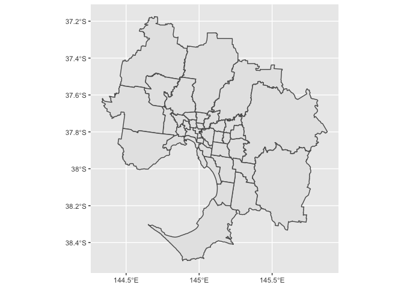
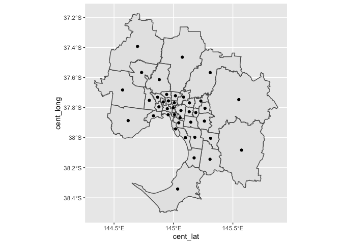
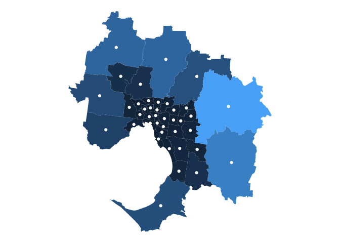
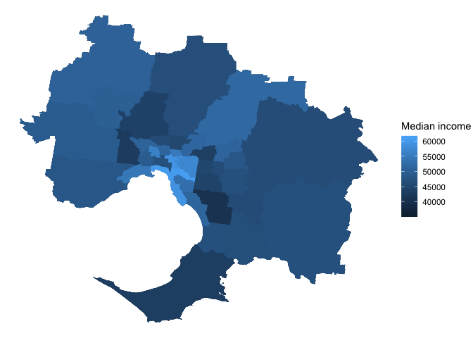

# absmaps

The `absmaps` package exists to make it easier to download, compress and convert ABS shapefile data to `sf` objects to be used in R.

## Installation

You can install `absmaps` from github with:

``` r
# install.packages("devtools")
devtools::install_github("wfmackey/absmaps")
```


Additionally, the `sf` package is required to handle the `sf` objects:
```r
install.packages("sf")
library(sf)
```

And we will use the `tidyverse` packages in this example:
``` r
library(tidyverse)
```


## Maps loaded with this package

Available maps are listed below. These will be added to over time. 
If you would like to request a map to be added, let me know via an issue on this Github repo.
(Or send me an email: wfmackey@gmail.com)

More details about ASGS structrues can be found on the [ABS website](http://www.abs.gov.au/websitedbs/D3310114.nsf/home/Australian+Statistical+Geography+Standard+(ASGS)).

### ASGS Main Structures


* Statistical Area 1 2011: area = `sa1`, year = `2011`
* Statistical Area 1 2016: area = `sa1`, year = `2016`
* Statistical Area 2 2011: area = `sa2`, year = `2011`
* Statistical Area 2 2016: area = `sa2`, year = `2016`
* Statistical Area 3 2011: area = `sa3`, year = `2011`
* Statistical Area 3 2016: area = `sa3`, year = `2016`
* Statistical Area 4 2011: area = `sa4`, year = `2011`
* Statistical Area 4 2016: area = `sa4`, year = `2016`
* Greater Capital Cities 2011: area = `gcc`, year = `2011`
* Greater Capital Cities 2016: area = `gcc`, year = `2016`
* State 2011: area = `state`, year = `2011`
* State 2016: area = `state`, year = `2016`


#### Remoteness areas

* Remoteness Areas 2011: area = `ra`, year = `2011`
* Remoteness Areas 2016: area = `ra`, year = `2016`

#### Mesh blocks

* NSW mesh blocks 2011: area = `mesh_nsw`, year = `2011`
* NSW mesh blocks 2016: area = `mesh_nsw`, year = `2016`
* Victoria mesh blocks 2011: area = `mesh_vic`, year = `2011`
* Victoria mesh blocks 2016: area = `mesh_vic`, year = `2016`
* Queensland mesh blocks 2011: area = `mesh_qld`, year = `2011`
* Queensland mesh blocks 2016: area = `mesh_qld`, year = `2016`
* SA mesh blocks 2011: area = `mesh_sa`, year = `2011`
* SA mesh blocks 2016: area = `mesh_sa`, year = `2016`
* WA mesh blocks 2011: area = `mesh_wa`, year = `2011`
* WA mesh blocks 2016: area = `mesh_wa`, year = `2016`
* Tasmania mesh blocks 2011: area = `mesh_tas`, year = `2011`
* Tasmania mesh blocks 2016: area = `mesh_tas`, year = `2016`
* NT mesh blocks 2011: area = `mesh_nt`, year = `2011`
* NT mesh blocks 2016: area = `mesh_nt`, year = `2016`
* ACT mesh blocks 2011: area = `mesh_act`, year = `2011`
* ACT mesh blocks 2016: area = `mesh_act`, year = `2016`
* Other mesh blocks 2011: area = `mesh_other`, year = `2011`
* Other mesh blocks 2016: area = `mesh_other`, year = `2016`


### ASGS Indigenous areas

* Indigenous locations 2011: area = `indigenous_locations`, year = `2011`
* Indigenous locations 2016: area = `indigenous_locations`, year = `2016`
* Indigenous area 2011: area = `indigenous_area`, year = `2011`
* Indigenous area 2016: area = `indigenous_area`, year = `2016`
* Indigenous regions 2011: area = `indigenous_regions`, year = `2011`
* Indigenous regions 2016: area = `indigenous_regions`, year = `2016`


### ASGS Non-ABS Structures

* Commonwealth Electoral Divisions 2018: area = `ced`, year = `2018`
* State Electoral Divisions 2018: area = `sed`, year = `2018`
* Local Government Areas 2016: area = `lga`, year = `2016`
* Local Government Areas 2018: area = `lga`, year = `2018`


## Just show me how to make a map with this package

### Downloading, compressing and converting an ABS shapefile

The `absmaps` package uses the `load_absmaps` to download and load a particular geospatial object:

``` r

library(absmaps)

mapdata1 <- load_absmaps(area = "sa3", year = 2011)

glimpse(mapdata1)
#> Observations: 351
#> Variables: 12
#> $ sa3_code_2011   <chr> "10101", "10102", "10103", "10104", "10201", "10…
#> $ sa3_name_2011   <chr> "Goulburn - Yass", "Queanbeyan", "Snowy Mountain…
#> $ sa4_code_2011   <chr> "101", "101", "101", "101", "102", "102", "103",…
#> $ sa4_name_2011   <chr> "Capital Region", "Capital Region", "Capital Reg…
#> $ gcc_code_2011   <chr> "1RNSW", "1RNSW", "1RNSW", "1RNSW", "1GSYD", "1G…
#> $ gcc_name_2011   <chr> "Rest of NSW", "Rest of NSW", "Rest of NSW", "Re…
#> $ state_code_2011 <chr> "1", "1", "1", "1", "1", "1", "1", "1", "1", "1"…
#> $ state_name_2011 <chr> "New South Wales", "New South Wales", "New South…
#> $ albers_sqkm     <dbl> 21236.6140, 6511.1214, 14281.8301, 9864.9397, 98…
#> $ cent_lat        <dbl> 149.0763, 149.6013, 148.9416, 149.8063, 151.2182…
#> $ cent_long       <dbl> -34.55399, -35.44940, -36.43958, -36.49934, -33.…
#> $ geometry        <MULTIPOLYGON [°]> MULTIPOLYGON (((149.1198 -3..., MUL…
```

Or

``` r
mapdata2 <- load_absmaps(area = "sa2", year = 2016)

glimpse(mapdata2)
#> Observations: 2,310
#> Variables: 15
#> $ sa2_main_2016   <chr> "101021007", "101021008", "101021009", "10102101…
#> $ sa2_5dig_2016   <chr> "11007", "11008", "11009", "11010", "11011", "11…
#> $ sa2_name_2016   <chr> "Braidwood", "Karabar", "Queanbeyan", "Queanbeya…
#> $ sa3_code_2016   <chr> "10102", "10102", "10102", "10102", "10102", "10…
#> $ sa3_name_2016   <chr> "Queanbeyan", "Queanbeyan", "Queanbeyan", "Quean…
#> $ sa4_code_2016   <chr> "101", "101", "101", "101", "101", "101", "101",…
#> $ sa4_name_2016   <chr> "Capital Region", "Capital Region", "Capital Reg…
#> $ gcc_code_2016   <chr> "1RNSW", "1RNSW", "1RNSW", "1RNSW", "1RNSW", "1R…
#> $ gcc_name_2016   <chr> "Rest of NSW", "Rest of NSW", "Rest of NSW", "Re…
#> $ state_code_2016 <chr> "1", "1", "1", "1", "1", "1", "1", "1", "1", "1"…
#> $ state_name_2016 <chr> "New South Wales", "New South Wales", "New South…
#> $ areasqkm_2016   <dbl> 3418.3525, 6.9825, 4.7634, 13.0034, 3054.4099, 1…
#> $ cent_lat        <dbl> 149.7932, 149.2328, 149.2255, 149.2524, 149.3911…
#> $ cent_long       <dbl> -35.45508, -35.37590, -35.35103, -35.35520, -35.…
#> $ geometry        <MULTIPOLYGON [°]> MULTIPOLYGON (((149.7606 -3..., MUL…
```

The resulting `sf` object contains one observation per area (in the
following examples, one observation per `sa3`). It stores the geometry
information in the `geometry` variable, which is a nested list
describing the area’s polygon. The object can be joined to a standard
`data.frame` or `tibble` and can be used with `dplyr` functions.

### Creating maps with your `sf` object


We do all this so we can create gorgeous maps. And with the `sf` object
in hand, plotting a map via `ggplot` and `geom_sf` is simple.

``` r
map <-
sa32016 %>%
  filter(gcc_name_2016 == "Greater Melbourne") %>%   # let's just look Melbourne
  ggplot() +
  geom_sf(aes(geometry = geometry))  # use the geometry variable

map
```

<!-- -->

The data also include centorids of each area, and we can add these
points to the map with the `cent_lat` and `cent_long` variables using
`geom_point`.

``` r
map <-
sa32016 %>%
  filter(gcc_name_2016 == "Greater Melbourne") %>%   # let's just look Melbourne
  ggplot() +
  geom_sf(aes(geometry = geometry)) +   # use the geometry variable
  geom_point(aes(cent_lat, cent_long))  # use the centroid lat and longs

map
```

<!-- -->

Cool. But, sidenote, this all looks a bit ugly. We can pretty it up
using `ggplot` tweaks. See the comments on each line for its objective.
Also note that we’re filling the areas by their `areasqkm` size, another
variable included in the `sf` object (we’ll replace this with more
interesting data in the next section).

``` r
map <-
sa32016 %>%
  filter(gcc_name_2016 == "Greater Melbourne") %>%   # let's just look Melbourne
  ggplot() +
  geom_sf(aes(geometry = geometry,  # use the geometry variable
              fill = areasqkm_2016),     # fill by area size
          lwd = 0,                  # remove borders
          show.legend = FALSE) +    # remove legend
  geom_point(aes(cent_lat,
                 cent_long),        # use the centroid lat and longs
             colour = "white") +    # make the points white
  theme_void() +                    # clears other plot elements
  coord_sf(datum = NA)              # fixes a gridline bug in theme_void()

map
```

<!-- -->

## Joining with other datasets

At some point, we’ll want to join our spatial data with
data-of-interest. The variables in our mapping data—stating the numeric
code and name of each area and parent area—will make this *relatively*
easy.

For example: suppose we had a simple dataset of median income by SA3
over time.

``` r
# Read data in some data
income <- read_csv("data/median_income_sa3.csv")

#> Parsed with column specification:
#> cols(
#>   sa3_name_2016 = col_character(),
#>   year = col_character(),
#>   median_income = col_double()
#> )
```

This income data contains a variable `sa3_name_2016`, and we can use
`dplyr::left_join()` to combine with our mapping data.

``` r
combined_data <- left_join(income, sa32016, by = "sa3_name_2016")
```

Now that we have a tidy dataset with 1) the income data we want to plot,
and 2) the geometry of the areas, we can plot income by area:

``` r
map <-
combined_data %>%
  filter(gcc_name_2016 == "Greater Melbourne") %>%   # let's just look Melbourne
  ggplot() +
  geom_sf(aes(geometry = geometry,  # use the geometry variable
              fill = median_income),        # fill by unemployment rate
          lwd = 0) +                # remove borders
  theme_void() +                    # clears other plot elements
  coord_sf(datum = NA) +            # fixes a gridline bug in theme_void()
  labs(fill = "Median income")

map
```

<!-- -->

## Why does this package exist?

The motivation for this package is that maps are cool and fun and are,
sometimes, the best way to communicate data. And making maps is `R` with
`ggplot` is relatively easy *when you have the right `object`*.

Getting the right `object` is not technically difficult, but requires
research into the best-thing-to-do at each of the following steps:

  - Find the ASGS ABS spatial-data page and determine the right file to
    download.
  - Read the shapefile into `R` using one-of-many import tools.
  - Convert the object into something usable.
  - Clean up any inconsistencies and apply consistent variable
    naming/values across areas and years.
  - Find an appropriate compression function and level to optimise
    output.

For me, at least, finding the correct information and developing the
best set of steps was a little bit interesting but mostly tedious and
annoying. The `absmaps` package holds this data for you, so you can
spend more time making maps, and less time on Stack Overflow, the ABS
website, and [lovely-people’s wonderful
blogs](https://www.neonscience.org/dc-open-shapefiles-r).

## How does this package do the-things-it-does

The `absmaps` package uses four key functions to do-the-things-it-does:

*  `utils::download.file` to download shapefile data from the ABS.
*  `sf::st_read` to read the shapefile into an `sf` object.
*  `rmapshaper::ms_simplify` to nicely compress the `sf` object.
*  `readr::write_rds` to write, and `readr::read_rds` to read our nice `sf` objects.

There are a bunch of other fiddley-things on top of that, but those four steps are the 'workhorse' functions. A big thanks to people who built them.

If you're interested, check out `load_absmaps.R` code in the `R/` file. And, of course, if you have a suggestion to improve, please do let me know via an issue at https://github.com/wfmackey/absmaps.


## I want to complain about this package

Fair enough\! The best avenue is via a Github issue at
(wfmackey/absmaps). This is also the best place to request data that
isn’t yet available in the package. You can also email me at wfmackey@gmail.com.
